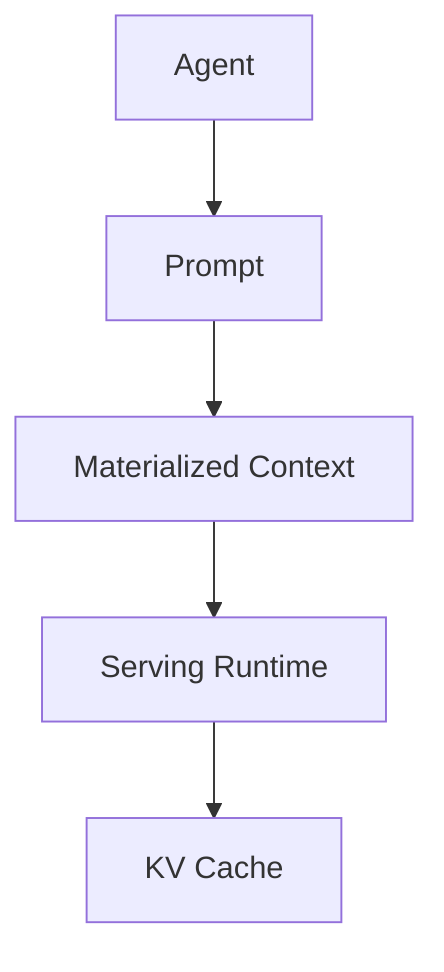
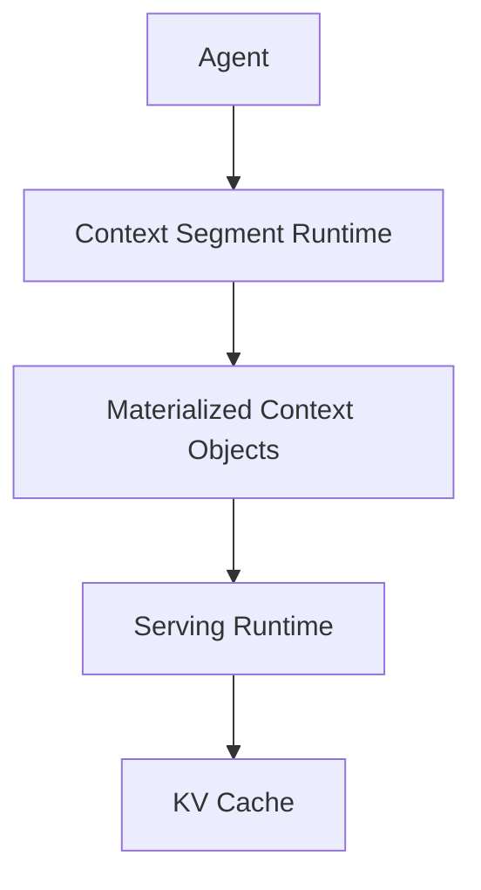

# Context Segment Runtime

This document defines the runtime abstraction used by the traced agent experiments.

The core claim is not a new cache policy. The claim is that existing serving runtimes use the wrong materialization unit for agentic workloads.

## Existing Runtime

Today, most serving stacks effectively expose this interface:

```python
generate(prompt: str) -> Response
```

The runtime sees a single prompt object and manages a single materialized context object. Any lifecycle variation inside that prompt is hidden from the runtime.



For long-horizon agents, this is the abstraction mismatch.

- `system` and `task` often remain live for many steps.
- `evidence`, `plan`, `summary`, and `scratchpad` can change or die much earlier.
- the runtime still treats the whole prompt as one materialization unit.

## Proposed Runtime

We introduce `ContextSegment` as the first-class runtime object representing independently materializable context.



The agent no longer hands a single opaque prompt to the runtime. It hands a segment-aware request whose pieces can be independently identified, reused, invalidated, offloaded, or rematerialized.

## 4.1 Context Segment

`ContextSegment` is the minimal runtime object.

```python
ContextSegment(
    state_id: str,
    identity: SegmentIdentity,
    version: int,
    size_bytes: int,
    token_count: int,
    workflow_id: str,
    text: str,
    supersedes: tuple[str, ...],
    metadata: dict[str, object],
)
```

Semantically, a `ContextSegment` is:

- one logical context module instance
- with a stable identity across versions
- and an explicit lifecycle boundary

Examples include:

- `system`
- `task`
- `evidence`
- `plan`
- `summary`
- `scratchpad`
- `artifact`
- `verification`

The important property is not the semantic label itself. The important property is that the runtime can refer to a segment independently of the full prompt.

## 4.2 Segment Identity

Identity is intentionally small.

```python
SegmentIdentity(
    logical_key: str,
    module: str,
)
```

The runtime uses:

- `logical_key` to track semantic continuity across versions
- `version` to distinguish updates
- `supersedes` to mark semantic death of older versions

A segment identity represents semantic continuity rather than textual equality.

This is enough to support:

- lookup
- reuse
- version transition
- targeted invalidation

without requiring the runtime to understand application semantics in detail.

## 4.3 Segment Lifecycle

Each segment has its own lifecycle.

- `live`: should remain reusable
- `dormant`: not immediately used, but still semantically reusable
- `superseded`: replaced by a newer version
- `released`: no longer needed by the workflow

In the current prototype, lifecycle is reconstructed from trace events:

- `CREATE` / `DERIVE`
- `READ`
- `SUPERSEDE`
- `RELEASE`

In offline analysis, the prototype reconstructs lifecycle after execution. In an online runtime, `SegmentRuntime` maintains the same lifecycle explicitly while execution is in progress.

## 4.4 Runtime Invariants

The runtime maintains three invariants.

Invariant 1.
Every `ContextSegment` has exactly one semantic identity.

Invariant 2.
A new version may supersede an older version, but it does not redefine the underlying segment identity.

Invariant 3.
Runtime operations preserve declared segment dependencies even when placement state changes.

## 4.5 Segment Runtime

`SegmentRuntime` is a thin layer above an existing serving engine.

Its job is not to replace vLLM or another backend. Its job is to make segment identity and lifecycle visible to the serving layer.

The minimal responsibilities are:

- maintain the materialization state of `ContextSegment` objects
- map segment identity to placement state
- build segment-aware generation requests
- apply targeted invalidation and reuse

Current canonical interface:

```python
class SegmentRuntime:
    def register_segment(self, segment: ContextSegment, *, initial_tier=None) -> None: ...
    def materialize_segment(self, state_id: str) -> None: ...
    def get_segment(self, state_id: str) -> ContextSegment: ...
    def lookup(self, state_id: str) -> bool: ...
    def build_group(self, *, group_id, workflow_id, consumer, ordered_segment_ids, prompt_id=None): ...
    def prepare_group_read(self, group, *, policy=None): ...
    def build_vllm_request(self, group): ...
    def invalidate_segment(self, state_id: str) -> None: ...
    def offload_segment(self, state_id: str) -> None: ...
    def evict_segment(self, state_id: str) -> None: ...
    def release_segment(self, state_id: str) -> None: ...
```

`ContextSegmentGroup` exists in the prototype because prompt assembly still needs an ordered set of segments for a single generation step. It should be read as an implementation structure, not the primary conceptual contribution.

## 4.6 Runtime State Machine

The current prototype uses the following state machine:

```text
UNREGISTERED
      |
   register
      v
REGISTERED
      |
 materialize
      v
RESIDENT
      |
   offload
      v
OFFLOADED
      |
 materialize
      v
RESIDENT
      |
   release
      v
RELEASED
```

Additional transitions are:

- `invalidate`: marks a segment as semantically unusable without redefining identity
- `evict`: removes any active materialization handle while keeping the runtime object live

## 4.7 Runtime Operations

The runtime needs only a small set of operations.

### `lookup`

Check whether a segment already has a reusable materialized handle.

`lookup hit -> reuse`

### `materialize`

Create a handle for a segment that is requested but not currently resident.

`lookup miss -> materialize`

### `invalidate`

Invalidate only the segment whose identity has changed or been superseded.

### `evict`

Move a segment out of the active tier without invalidating unrelated segments.

### `reuse`

Bind an already-resident segment into a new segmented generation request.

These operations are enough to express the difference between:

- current monolithic prompt management
- segment-aware context management

## Thin Runtime Layer

The intended implementation stack is:

```text
Agent / Orchestrator
    -> SegmentRuntime
    -> Serving Runtime (vLLM, later possibly others)
    -> KV cache / placement layer
```

This is deliberate.

- the abstraction should outlive any specific backend
- the serving engine may change
- the first-class runtime object should not

## Current Prototype Mapping

The current prototype code uses these canonical names:

- `ContextSegment`
- `ContextSegmentGroup`
- `SegmentRuntime`
- `SegmentedGenerationRequest`
- `RuntimeResidencySnapshot`
- `RuntimePlacementDecision`
- `ReuseAwareRuntimePolicy`

Older prototype names such as `SegmentMaterializer` remain as compatibility aliases.

## Why This Matters

This abstraction makes the runtime argument explicit.

1. Agentic workloads exhibit heterogeneous context lifecycles.
2. Current runtimes flatten them into one materialized context object.
3. Therefore the runtime cannot manage those lifecycles independently.
4. `ContextSegment` exposes lifecycle as a first-class runtime abstraction.

The characterization and oracle analyses motivate the first three points. `ContextSegment` and `SegmentRuntime` answer the fourth.
